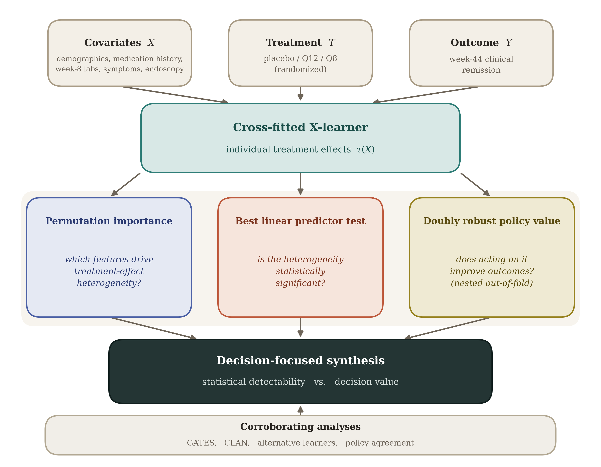

# UNIFI Causal-ML Analysis

Code accompanying **"A Causal Machine Learning Framework for Treatment
Personalization in Clinical Trials: Application to Ulcerative Colitis"**
(Minoccheri, Tesic, Najarian, Stidham).

The pipeline estimates conditional average treatment effects (CATEs) with a
cross-fitted X-learner, tests for endoscopic contribution beyond clinical
features (best linear predictor), evaluates doubly robust policy value
(including nested out-of-fold estimation), and runs prognostic and extended
validation analyses (GATES, CLAN, alternative learners, policy agreement).



*Overview of the framework: from randomized-trial data (covariates X, treatment
T, outcome Y), a cross-fitted X-learner estimates individual treatment effects,
which feed permutation importance, best-linear-predictor testing, and doubly
robust policy-value evaluation with nested out-of-fold assessment; these are
contrasted in a decision-focused synthesis and corroborated by GATES, CLAN,
alternative-learner, and policy-agreement analyses.*

---

## 1. Requirements

- Python 3.12 (the canonical run used 3.12.7; 3.11+ should also work)
- The pinned packages in `requirements.lock.txt`

```bash
python3 -m venv venv
source venv/bin/activate            # Windows: venv\Scripts\activate
pip install -r requirements.lock.txt
```

`requirements.lock.txt` is the exact, transitive freeze used for the canonical
run (XGBoost 3.3.0 on Python 3.12.7); installing it reproduces the manuscript
values bit-for-bit.

`openpyxl` is required (pandas uses it to read the `.xlsx`) even though no
script imports it directly.

## 2. Data

The trial data are **not public** (data-sharing agreement with the sponsor;
NCT02407236). Qualified researchers may request access from the sponsor.

The loader (`causal_utils.load_unifi_data`) expects the treatment indicators
`MaintMed_UST_12`, `MaintMed_UST_Q8`, the outcome
`Remission_Full_CALC_wk44_ITT`, and the feature columns listed in Table 1 of
the manuscript.

## 3. Running the analysis

### Main analysis (reproduces the manuscript tables and figures)

```bash
python run_analysis.py                       # prints results to the console
python run_analysis.py > run_analysis_output.txt 2>&1   # capture to a file
```

Writes `fig1_feature_importance.pdf`, `fig2_policy_forest.pdf`, and
`fig3_cate_distributions.pdf` to the current directory, plus a set of
`table_*.csv` files (feature importance per contrast, the policy/BLP/agreement summary, multi-arm
out-of-fold values, prognostic contribution, GATES, CLAN, the estimator
comparison, and the predictive-CV summary).

### Multi-seed reproducibility (headline + per-arm prognostic ranges)

```bash
python reproducibility_multiseed.py                 # 20 seeds (0..19), default
python reproducibility_multiseed.py --seeds 50      # seeds 0..49
python reproducibility_multiseed.py --seeds 0-9     # explicit range
python reproducibility_multiseed.py --boot 2000     # bootstrap reps per seed
python reproducibility_multiseed.py --no-prognostic # skip the per-arm block
```

Writes `supp_reproducibility_multiseed.csv` (headline quantities per seed) and
`supp_reproducibility_prognostic.csv` (per-arm AUROC/Brier per seed). This
characterizes seed/environment sensitivity around the canonical single-seed run
and is the source for the manuscript's across-seed ranges (Table 5, the
prognostic paragraphs, and the stability paragraph in the Discussion).

### Supplementary analyses

The supplementary sections (A–E) are produced by `reproducibility_multiseed.py`.
To run only these sections and skip the multi-seed sweep:

```bash
python reproducibility_multiseed.py --skip-multiseed
```

Sections A, B, and D run by default (missing-data report, hyperparameter
sensitivity, multiplicity-adjusted BLP p-values).

## 4. Reproducibility

Models are configured for determinism: XGBoost uses `tree_method="exact"`,
`n_jobs=1`, and a fixed seed (`causal_utils.DEFAULT_RANDOM_STATE = 42`). Given
the same data and package versions, results are reproducible run to run.

Across package versions, small drift is expected. Gradient-boosted trees
can build slightly different trees across XGBoost releases, which shifts
downstream point estimates modestly.


## 5. Files

| File | Purpose |
|------|---------|
| `causal_utils.py` | Methods library (X-learner, BLP, DR policy value, nested OOF, prognostic metrics, GATES/CLAN, alternative learners, plotting). |
| `run_analysis.py` | Runs the full pipeline; prints all tables and saves figures. |
| `reproducibility_multiseed.py` | Supplementary sections (A–E) and the multi-seed reproducibility sweep; writes the `supp_*.csv` files (headline and per-arm prognostic quantities across seeds). |
| `requirements.lock.txt` | Pinned dependency freeze for exact environment reproduction. |

## 6. Citation

If you use this code, please cite the manuscript above. Code:
https://github.com/Minoch/UNIFI_causal
